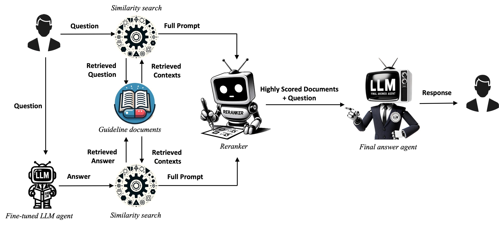

# QA-RAG
Code for the paper, From RAG to QA-RAG: Integrating Generative AI for Pharmaceutical Regulatory Compliance Process(https://arxiv.org/abs/2402.01717)

This repository contains the source code for the QA-RAG (Question and Answer Retrieval Augmented Generation) model, a tool designed for the pharmaceutical regulatory compliance domain. It integrates generative AI and RAG methodologies to efficiently navigate complex regulatory guidelines, providing accurate and relevant information through a Q&A format.




   **Important Note**
   
   Unfortunately, due to current OpenAI policies, the QA-RAG model can only be operated using the API key of the person who performed the fine-tuning. This means that until policy changes, it is not possible for others to run the QA-RAG model directly. However, for those interested in experimenting with aspects of the research, the repository provides resources to conduct experiments using Multiquery, HyDE methodologies, or the "Only question" approach. Additionally, users can perform their own fine-tuning using the provided dataset and then modify the FineTunedAnswerRetriever class to work with their newly fine-tuned model. This offers a way to customize the QA-RAG model for specific needs or datasets.


---

### Getting Started

1. **Install Required Packages**
   
    Install all the necessary Python packages listed in `requirements.txt`.
  
    ```python
    !pip install -r requirements.txt
    ```
2. **Add OpenAI API Key to Config File**

   Open the config.py file and insert your OpenAI API key. 

    ```python
    # In config.py
    OPENAI_API_KEY = "Your-OpenAI-API-Key-Here"
    ```
    
3. **Initialize Models**
    
   Run the script `initialize_model.py` to download and set up the embedding and reranker models.
      
    ```python
    !python initialize_model.py
    ```

4. **Run the Model**
   
   Use `main.py` to execute the model. Here's the basic command structure:
      
    ```python
    !python main.py --question "<Your Question>" --top_k <Top K Docs> --top_k_ans <Top K Docs from Answer> --num_docs <Number of Initial Docs> --num_docs_ans <Number of Initial Docs from Answer> --final_k <Final Number of Docs> --method <Specific method to use>
    ```

    --question: Your query related to the guidelines.
   
    --top_k: Number of top documents to retrieve initially.
   
    --top_k_ans: Number of top documents to retrieve based on the model-generated answer.
   
    --num_docs: Total number of documents to retrieve initially.
   
    --num_docs_ans: Total number of documents to retrieve based on the answer.
   
    --final_k: Number of final top documents to return after reranking.
   
    --method: Specific method to use. Choose the method to use: QA_RAG, Multiquery, or HyDE


    **Example**
   - Using QA_RAG:
    ```python
    !python main.py --question "How can I get the information of FDA?" --top_k 3 --top_k_ans 3 --num_docs 5 --num_docs_ans 5 --final_k 2 --method QA_RAG
    ```

   - Using Multiquery:
    ```python
    !python main.py --question "What are the latest FDA guidelines for clinical trials?" --top_k 3 --top_k_ans 3 --num_docs 5 --num_docs_ans 5 --final_k 2 --method Multiquery
    ```

   - Using HyDE:
    ```python
   !python main.py --question "What are the requirements for drug labeling as per FDA?" --top_k 5 --top_k_ans 5 --num_docs 7 --num_docs_ans 7 --final_k 4 --method HyDE
    ```
        
---

### Repository Structure
**main.py**: The main script to run the QA-RAG model.

**config.py**: Configuration file containing essential settings.

**embeddings.py**: Script to handle embedding processes.

**model.py**: Contains the main logic for the Document Retriever, Answer Generator, and other components.

**reranker.py**: Handles the reranking of retrieved documents.

**initialize_model.py**: Initializes and sets up models.

---

### Experimental Data
**Dataset**: The dataset that was used in the experiments in the paper is included. It's composed of real-world questions and answers related to FDA guidelines. The full dataset used for the finetuning is available [here](https://huggingface.co/datasets/Jaymax/FDA_Pharmaceuticals_FAQ).

**Results Data**: Alongside the dataset, the results data obtained from running the experiments is included
